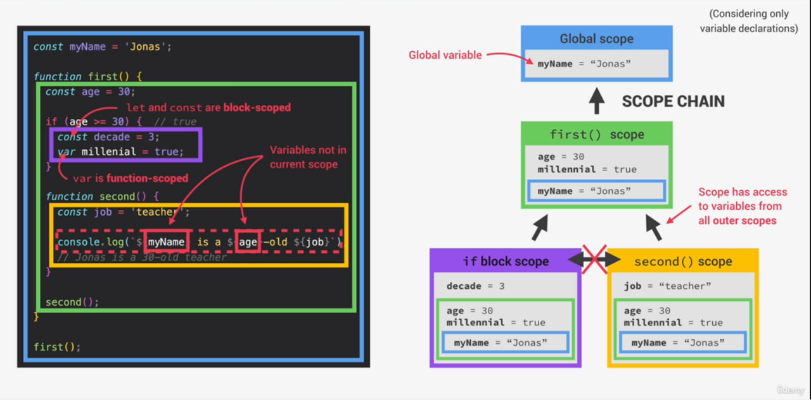
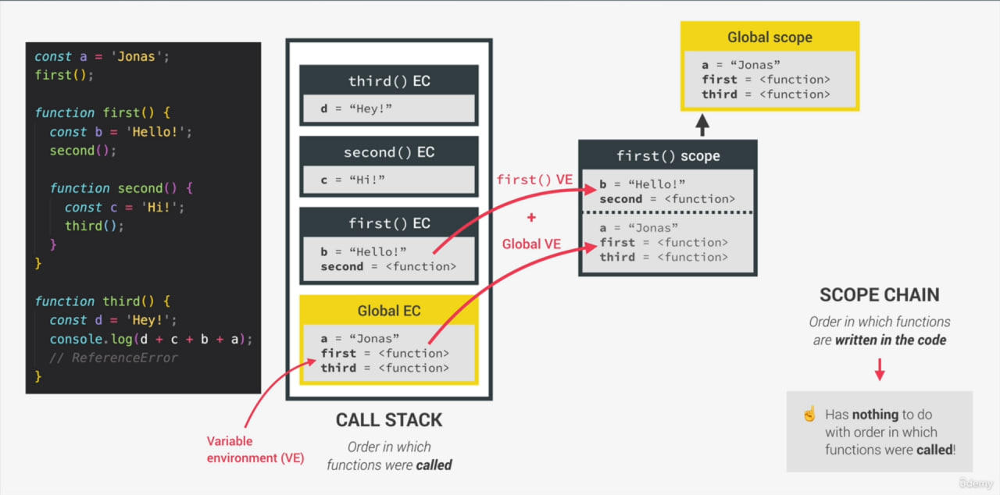

## What is JAVSCRIPT : REVISITED

> JavaScript is a `High-Level`, `Prototype-based` `Object-oriented`, `Multi-paradigm`, `Interpreted` Or `Just-in-Time Compiled`, `Dynamic`, `Single-Threaded`, `Garbage-collected` Programming Language with `First-class Functions` and a `Non-blocking Event Loop Concurrency Model`.

- High-level - low level language တွေဟာ resources တွေကို ကိုယ်တိုင် manage (CUP, RAM and etc.) ပြုလုပ်ရပါတယ် ဥပမာ - variable တစ်ခုကို create လုပ်မို့ computer memory ကို အရင် access လုပ်ပေးရပါတယ်။ High-level တွေမှာတော့ ဒီလိုလုပ်မို့ မလိုအပ်ပါဘူး

- Garbage-collected - ဒါကတော့ memory management ဖြစ်ပါတယ်။ js engine အတွင်း အသုံးမပြုတဲ့ variable တွေကို computer memory ကနေ auto remove ပြုလုပ်ပေးပါတယ်။

- Interpreted or Just-in-Time Compiled - code တွေကို execute (convert human readable to machine code 0 and 1) လုပ်တဲ့အခါမှာ compiling နဲ့ Interpret ဆိုပြီး နည်းလမ်း နှစ်ခုရှိပါတယ်။ JS ကတော့ နှစ်မျိုးစလုံး ပေါင်းစပ်ပြီး Just-in-Time compile အနေနဲ့အလုပ်ပါတယ်။

- Multi-paradigm - Paradigm is an approch and mindset of structing code, which will direct your coding style and technique.

  1. Procedual programming
  2. Object-oriented programming (OOP)
  3. Functional programming (FP)

  <br/>

- Impreative vs Declarative

- Prototype-based object-oriented - Prototype is an blueprint. array is build from prototype of array object and can inherit methods from prototype

```js
// Array
//     Array.prototype.push
//     Array.prototype.

const arr = [1, 2, 3]; // built from prototype

arr.push(4);

const hasZero = arr.indexOf(0) > -1; // inherit method from Array prototype
```

- First-class functions - In a language with `first-class functions`, functions are simply `treated as variables.` We can pass them into other functions, and return them from functions.

```js
const closeModal = () => {
  modal.classList.add("hidden");
  overlay.classList.add("hidden");
};

overlay.addEventListener("click", closeModal);
```

- Dynamic - Dynamically-typed the type of data types can be changed easily and reassign variables.

```js
let x = 23; // number
let y = 19; // number

x = "jonas"; // string
```

- Single-threaded -

- Non-blocking event loop -

> `Concurrency Modal` : how the JavaScript engine handles multiples tasks happening at the same time.

> JavaScript - runs in one `single thread`, so it can only do one thing at a time.(mean one thing at a time.) we need to handles multiple things happening at the same time.In computing a thread is like a set of instructions that is executed in the computer's CPU. what if there is a `long-running task` like `fetching data` from remote server, it is block single thread. That's why we want is so-called `non-blocking` behavior and by using a so-called event loop. The event loop takes long-running tasks, executes them in the `background` and then puts them back in the `main thread` once they are finished.

- JS Engine is build inside of JS runtime

- JS runtime in Web Browsers &mdash;

  1. JS Engine - call stack, heap
  2. Web APIs - DOM, Timers, Fetch API and etc. (access global window object)
  3. Callback Queue - call, timere, data and etc.

- JS runtime in Node.js &mdash;

  1. JS Engine - call stack, heap
  2. C++ Binding & Thread Pool
  3. Callback Queue - call, timere, data and etc.

- JS Engine

  1. Call Stack
  2. Heap

  JS Engine တွင် Callstack နှင့် Heap ဆိုပီး ရှိတယ်။ Callstack သည် EC (execution context) ရေးသားထားသော code တွေကို execute လုပ်သောနေဖြစ်ပါသည်။ Heap သည် Object တွေကို သိမ်းဆည်‌ပေးသော နေရာ ဖြစ်ပါသည်။

- `Compilation`: Entire code is converted into machine code at once, and written to a binary file that can be executed by a computer.

source code -> Protable file/portable file -> Program running

- `Interpretation`: Interpreter runs through the source code and executes it line by line. (much slower than compiler) old version ok but modern js not ok!

source code -> program running

- `Just-in-Time (JIT) compilation`: Entire code is converted into machine code at once, then executed immediately.

Source code -> Machine code/not a portable file -> Program running.

code -> Parsing(AST) -> compilation and execution

`first step` - parse the code, check each line that are meaningful to the language like const or function keywords. also checks if there are any syntax errors

`Next Step` - Compilation, generate and compiles it into machine code and executed right aways and execution happens in the js engine call stack. js actually have some pretty clever optimization strategies. what they do is to create a very unoptimized version of machine code in the beginning just so that it can start executing as fast as possible.Then in the background, this code is being optimized and recompiled during the already running program execution.And this can be done most of the times and after each optimization the unoptimized code is simply swept for the new more optimized code without ever stopping execution. all parsing, compilation and optimization happens in some special threads inside the engine that we cannot access from our code.So completely separate form the main thread that is basically running into call stack executing our own code.

AST - Abstract Syntax Tree

### What is an execution context?

1. Creation of global execution context (Global EC) (for top-level code) that is not inside any function, outside of code will be executed. function is executed when they are called

```js
/*
Global => 
name = 'Zaw linn';
first = <function>
second = <function>
x = <unkown>

after first() is finished

x = 3;

first() => 
a = 1
b = <unkown>

after second() is finished

b = 2;

return a and remove first(); 


second() =>
c = 2
argument = [7, 9]

return c and remove second() function

*/
const name = "Zaw linn";
const first = () => {
  let a = 1;
  const b = second(7, 9);
  a = a + b;
  return a;
};

function second(x, y) {
  var c = 2;
  return c;
}
const x = first();
```

ဒီ Code မှာ `name`, `first` and `second` သည် top level code တွေ ဖြစ်ကြပါတယ်။
Enviroment ဆိုတာ JavaScript code တွေ Execute လုပ်မို့ လိုအပ်တဲ့ code တွေ သိုလောင်ထားတဲ့ နေရာဖြစ်ပါတယ်။

Global Exection Context သည် default context တစ်ခုဖြစ်ပြီး သူက အရင်ဆုံး အလုပ်လုပ်ပါတယ်။

ပြီးတဲ့အခါမှာ function တစ်ခုချင်းအတွက် Execution Context တစ်ခုချင်းကို Create လုပ်ပေးပါတယ်။ အကယ်၍ callback ရှိခဲ့သော် ၎င်းကို execute လုပ်ရန် JS Engine က ဆက် Run နေပါသေးတယ်။

Execution Context တိုင်းမှာ

1. Variables Environment

   ✔️ Let, const and var declaration

   ✔️ Functions

   ✔️ Arguments Object

2. Scope Chain
3. `this` keyword - Creation Phase ပေါ် မူတည်ပြီး Generated လုပ်သွားပါတယ်။

> this three steps are generated in a so-called creation phase.

> Note: Function အတွင်းက Variable Environment တွေကတော့ function ပီတာနက် ပျောက်ကွယ်သွားလို့ အပြင်ကနေ အသုံးပြုလို့ရမှာ မဟုတ်ပါဘူး ခင်ဗျာ။ Arrow Function EC မှာတော့ argument object နဲ့ `this` keyword ကို အသုံးပြုလို့ရမာ မဟုတ်ပါဘူး ခင်ဗျာ။ Function EC တွေဟာ Return Value ပေးပီး ပျက်သွားတာ ဖြစ်ပေမဲ့ Global EC ကတော့ browser tab or browser window ပိတ်ချမှာသာ ပျက်သွားမာ ဖြစ်ပါတယ်။

### SCOPE CONCEPTS

`Scoping` - ဆိုတာ JS Engine က Variable တွေကို ဘယ်လို စုစည်းပီး access လုပ်တာလဲ ဘယ်လို Organized လုပ်ပီး variable တွေ ဘယ်ချိန်ထိ ရှင်သန်လဲ ဆိုတာပဲ ဖြစ်ပါတယ်။

`Lexical Scoping` : ဆိုတာ parent Function တစ်ခုထဲ အခြား child function တစ်ခုရှိပီး child function က parent function ထဲတွင် သတ်မှတ်ထားသော variable ကို access လုပ်နိုင်ခြင်းဖြစ်ပါတယ်။

`Scope` : ဆိုတာ variable ကို ကြေငြာပေးနိုင်တဲ့ space or environment တစ်ခုပဲ ဖြစ်ပါတယ်။ Scope သုံးမျိုးရှိပါတယ်။

1.  Global Scope,
2.  Function Scope and
3.  Block Scope (ES6) တို့ပဲ ဖြစ်ပါတယ်။

`Scope of a variable` : ဆိုတာ variable တစ်ခုကို access လုပ်နိုင်တဲ့ region ကိုရည်ညွှန်းပါတယ်။

> function ဆိုတာလည်း variable တစ်ခုဖြစ်ပါတယ်။

| Global Scope                                                   | Function Scope                                               | Block Scope(ES6)                                          |
| -------------------------------------------------------------- | ------------------------------------------------------------ | --------------------------------------------------------- |
| Outside of any function or block                               | Variables are accessible only `inside function. NOT` outside | Variabls are accessible only `inside block`(block scoped) |
| Variables declared in global scope are accessible `everywhere` | Also called local scope                                      | `However, this only applies to `let`and`const` variables! |
|                                                                |                                                              | Functions are `also block scoped`(only in strict mode)    |

<!--
> [!NOTE]
> EXAMPLE Text SAMPLE

> [!WARNING]
> EXAMPLE Text SAMPLE

> [!CAUTION]
> EXAMPLE Text SAMPLE

> [!IMPORTANT]
> EXAMPLE Text SAMPLE -->

> [!TIP] > `let` and `const` are block scope and var is function scope in ES5. in `strict mode` ES6 all `function` are block scope

=> Global Scope

```js
const me = "Zaw Linn";
const job = "Staff";
const birthYear = 1997;
```

=> Function Scope

```js
function calcAge(birthYear) {
  const now = 2025;
  const age = now - birthYear;
  return age;
}

console.log(calcAge(1997)); //
console.log(now); // RefrenceError
```

=> Block Scope

```js
if (year >= 1981 && year <= 1996) {
  const millenial = true;
  const food = "Avocado toast";
} //  If block for loop block, etc.

console.log(millenial); // ReferenceError
```

SCOPE CHAIN &mdash;



SCOPE & SCOPE CHAIN &mdash;



### Hoisting in JavaScript

`Hoisting` : Variable မကြေငြာခင် အဲဒီ variable or function ကို ခေါ်ယူအသုံးပြုခြင်းကို ခေါ်ဆိုတပါသည်။

- `function`, let and const are block scope
- `var` is hoisted and initial vlaue is undefined and it's function scope
- `let` and `const` initial value are TDZ<uninitialized> and no Hoisted
- function expression and arrow - depends if using var or let/const

> TDZ - Temporal Dead Zone

1. Makes it easier to avoid and catch errors :
2. Makes const variable actually work

### How the `this` keyword

- `this` keyword/variable : Special variable that is created for every execution context (every function). Takes the value of (points to) the "owner" of the function in which the `this` keyword is used.

- `this` is NOT static: It depends on how the function is called, and its value is only assigned when the function is actually called.

  > Method 👉 this = \<Object that is calling the method.\>

  > Simple Function call 👉 this => undefined. (!in strict mode! Otherwise window/global object (in the browser))

  > Arrow Function 👉 this => \<this of surronding function(lexical this)\>

  > Event listener 👉 this => \<DOM element that the handler is attached to\>

  > new, call, apply, bind 👉 \< Later in the Course 🍷 \>

  > [!CAUTION]  
  > this does `NOT` point to the function itself, and also NOT the variable environment!

### PRIMITIVES - Store in Call stack

1. Number
2. String
3. Boolean
4. Undefined
5. Null
6. Symbol
7. BigInt

### OBJECTs - Store in Heap - REFERENCE TYPE

1. Object literal
2. Arrays
3. Functions
4. Many more...
